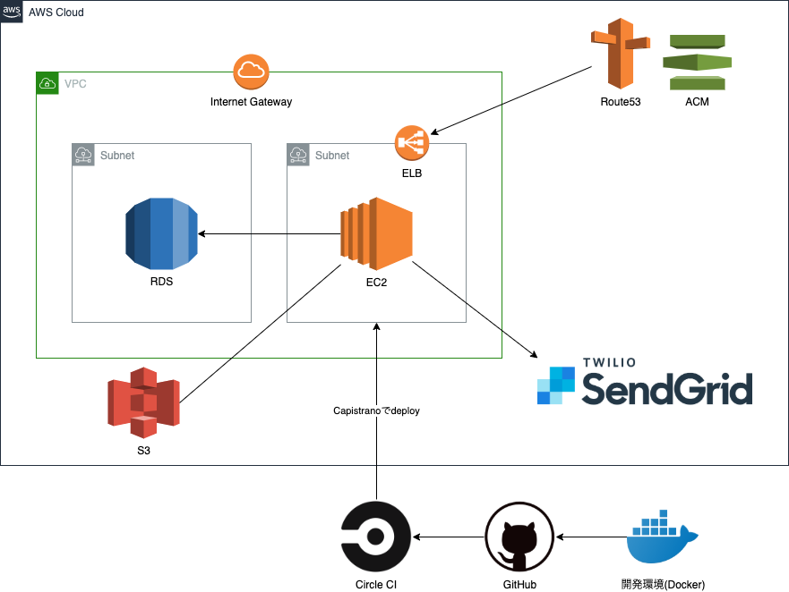

<h1>Ticket Rec</h1>
<h2>アプリケーションの概要</h2>

音楽イベントへの参加を記録し、共有するイベント記録サイトです。

<a href="https://www.ticket-rec.com/" alt="TicketRecUrl">https://www.ticket-rec.com/</a>
トップページからユーザー情報の入力なしでゲストログインが可能です。

<h2>アプリケーションの目的</h2>

音楽イベントはその場で音楽を体感することはもちろんですが、近年はその感動を記録し共有することも大切な要素となっています。

しかし多くの音楽ファンが利用している一般的なツールでは、過去の記録は日が経つにつれ埋もれしまい、自分がどのような体験をしたか振り返る事が困難です。

本サービスでは記録サイトとして音楽イベントに特化することにより、体験を振り返ることはもちろん、新たな音楽との出会いを可能にします。
<h2>主な対象者</h2>
音楽イベントが好きな方はもちろん、新しい音楽や仲間を探したい方など。
<h2>アプリケーションの機能一覧</h2>
<ul>
<li>ユーザー認証・CRUD機能（Devise等）</li>
<li>投稿のCRUD機能</li>
<li>画像投稿機能（ActiveStorage）</li>
<li>投稿に対するコメント機能</li>
<li>いいね機能（投稿へのいいねを登録・削除）</li>
<li>フォロー機能（ユーザーのフォローを登録・削除・一覧表示）</li>
<li>通知機能（いいね・フォロー・コメント）</li>
<li>検索機能（ユーザー、投稿の検索）</li>
<li>天気予報取得（Open Weather Map API）</li>
<li>音楽アーティストの画像・試聴トラックの取得（Spotify API）</li>
<li>過去に訪れた都道府県を地図で表示（Google Chart）</li>
<li>ユーザーにお勧めアーティストを提案</li>
<li>投稿した予定の前日に詳細・天気予報を自動でメール送信（Whenever・SES）</li>
<li>モーダルウィンドウ（投稿フォーム・Google Chart）</li>
<li>ページネーション機能（Kaminari）</li>
<li>カレンダー機能（Simple Carendar）</li>
</ul>
<h2>使用技術</h2>
<h3>環境</h3>
<ul>
  <li>Rails: 5.2.4.3</li>
  <li>Ruby: 2.5.1</li>
  <li>Postgresql: 12.3</li>
  <li>Docker/docker-compose</li>
</ul>
<h3>インフラ</h3>
<ul>
  <li>AWS：EC2、RDS、S3、VPC、Elastic IP、Route53、ELB、ACM</li>
  <li>アプリケーションサーバー：Unicorn</li>
  <li>Webサーバー：Nginx</li>
  <li>デプロイ方法：Capistranoによる自動デプロイ</li>
  <li>CI：Circle CIによるCI/CDパイプライン</li>
</ul>
<h3>AWS構成図</h3>

<h2>ER図</h2>

<h3>その他の技術</h3>
<ul>
  <li>テスト（RSpec）</li>
  <li>リンター（Rubocop Airbnb）</li>
  <li>GitHub（GitHub Flowでの開発）</li>
  <li>Javascript/JQuery</li>
  <li>AWS SESでのメールサービス</li>
  <li>Web API（Open Weather Map, Spotify）</li>
  <li>独自ドメインでのSSL化</li>
</ul>
